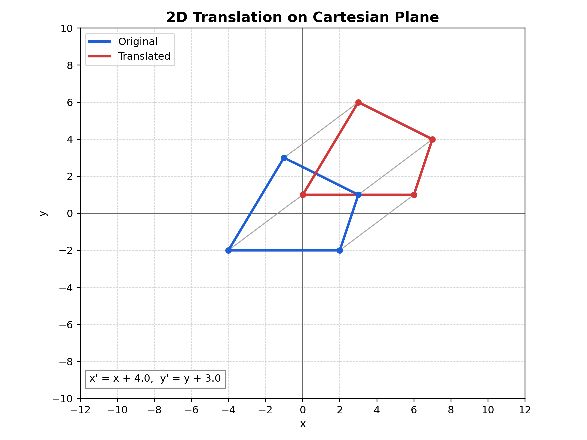

# 2D Translation Note (Theory + Exact Matrix)

## Relevant Files
- Main demo: tutorials/lineDrawing/05_2d_translation.py
- Composition demo (all transforms): tutorials/lineDrawing/10_composing_transformations_.py
- Source reference set: tutorials/2Dtrasformations/notes/2D-Transformations.pptx.pdf

## Theoretical Base
Translation is a rigid transform that moves every point by the same vector.

For translation vector t = (tx, ty):
- x' = x + tx
- y' = y + ty

Important properties:
- Distances and angles are preserved.
- Orientation is preserved.
- Translation does not depend on the point position relative to origin.

## Exact Matrix Forms

### 2x2 form is not enough
Translation cannot be represented by only a 2x2 matrix in Cartesian form.
It requires homogeneous coordinates.

### Homogeneous 3x3 matrix
T(tx, ty) =

```text
| 1  0  tx |
| 0  1  ty |
| 0  0   1 |
```

Applied to a point:

```text
| x' |   | 1  0  tx |   | x |
| y' | = | 0  1  ty | * | y |
| 1  |   | 0  0   1 |   | 1 |
```

## Non-Origin Handling (General Composition Rule)
For transformations around a pivot p = (px, py), we use:

```text
T(px, py) * M * T(-px, -py)
```

For translation alone, pivot wrapping is unnecessary because translation is already global:

```text
P' = T(tx, ty) * P
```

## Parameter Meaning
- tx: shift along x-axis (right if positive)
- ty: shift along y-axis in Cartesian coordinates (up if positive)

## Worked Example
Given P = (20, -10), tx = 35, ty = 15:

- x' = 20 + 35 = 55
- y' = -10 + 15 = 5

So P' = (55, 5)

## Cartesian Plane Graph


Figure description: blue is the original polygon, red is the translated polygon, and gray segments show vertex displacement vectors.

## How to Verify in Code
In tutorials/lineDrawing/05_2d_translation.py:
- The matrix top-right value is tx.
- The matrix middle-right value is ty.
- Every vertex connector (gray line) should be parallel and same length for same tx, ty.

## Common Mistakes
- Mixing screen-space y direction with Cartesian y direction.
- Trying to encode translation in a 2x2 matrix.
- Applying translation before/after other transforms without understanding order.

## Quick Practice
1. Set tx = 0, ty = 120 and confirm only vertical shift occurs.
2. Set tx = -80, ty = -60 and verify every vertex moved by exactly (-80, -60).
3. Compare T(30, 10) then T(-30, -10) to confirm identity effect.
