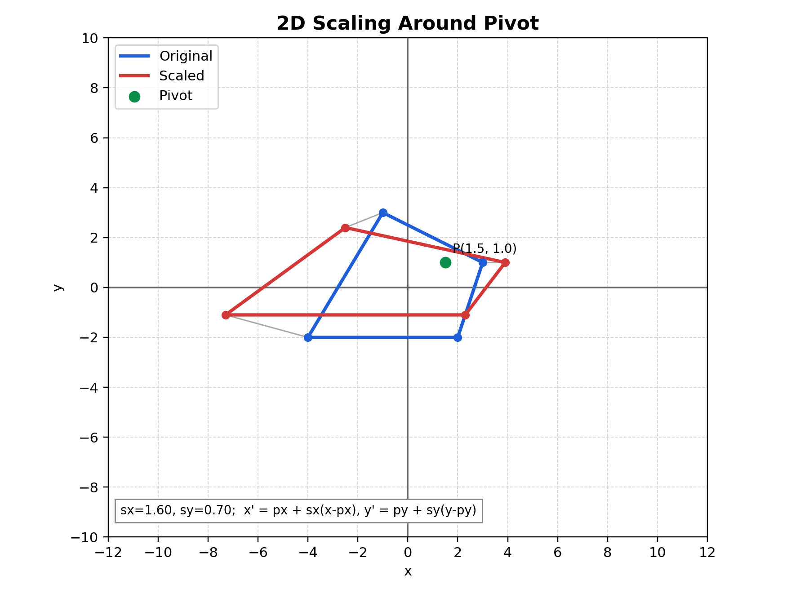

# 2D Scaling Note (Theory + Exact Matrix)

## Relevant Files
- Main demo: tutorials/lineDrawing/06_2d_scaling.py
- Composition demo: tutorials/lineDrawing/10_composing_transformations_.py
- Java reference: tutorials/2Dtrasformations/java_notes/scaling.java

## Theoretical Base
Scaling changes size by multiplying coordinates by scale factors.

About origin:
- x' = sx * x
- y' = sy * y

About pivot p = (px, py):
- x' = px + sx * (x - px)
- y' = py + sy * (y - py)

Important properties:
- Uniform scaling if sx = sy.
- Non-uniform scaling if sx != sy.
- Negative scale flips orientation across one axis.

## Exact Matrix Forms

### About origin (2x2)

```text
| sx   0 |
|  0  sy |
```

### About origin (3x3 homogeneous)

```text
| sx   0   0 |
|  0  sy   0 |
|  0   0   1 |
```

### About arbitrary pivot p = (px, py)

```text
S_p = T(px, py) * S * T(-px, -py)
```

Expanded exact 3x3 matrix:

```text
| sx   0   px*(1-sx) |
| 0   sy   py*(1-sy) |
| 0    0       1     |
```

## Composition Rule (Non-Origin Workflow)
When scaling around a point not at origin:
1. Translate to origin: T(-px, -py)
2. Scale at origin: S(sx, sy)
3. Translate back: T(px, py)

## Parameter Meaning
- sx: x-axis scale factor
- sy: y-axis scale factor
- p = (px, py): fixed point of scaling

Interpretation:
- sx > 1 or sy > 1 -> enlargement
- 0 < sx < 1 or 0 < sy < 1 -> reduction
- sx < 0 or sy < 0 -> reflection combined with scaling

## Worked Example
Scale P = (40, 10) about pivot (20, -10) with sx = 1.5, sy = 0.5:

- x' = 20 + 1.5*(40 - 20) = 50
- y' = -10 + 0.5*(10 - (-10)) = 0

Result: P' = (50, 0)

## Cartesian Plane Graph


Figure description: blue is original, red is scaled, and the green marker is the pivot that remains fixed.

## How to Verify in Code
In tutorials/lineDrawing/06_2d_scaling.py:
- Click a pivot and verify pivot marker stays fixed.
- For sx = sy, shape keeps similarity.
- For sx != sy, shape gets stretched differently per axis.

## Common Mistakes
- Using origin matrix when pivot scaling is required.
- Forgetting translation terms px*(1-sx), py*(1-sy).
- Letting sx or sy become 0 unintentionally (collapses shape).

## Quick Practice
1. Set sx = sy = 2 around origin and measure one edge ratio.
2. Move pivot and repeat to see same ratio but different position.
3. Use sx = 2 and sy = 0.5 and describe anisotropic scaling.
