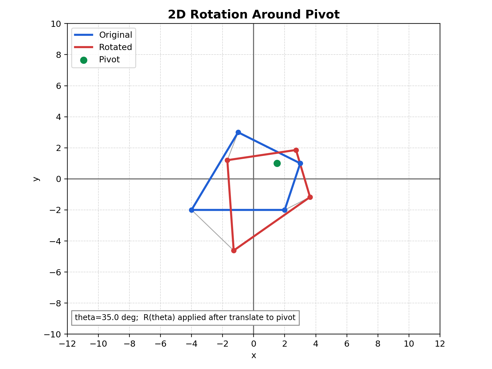

# 2D Rotation Note (Theory + Exact Matrix)

## Relevant Files
- Main demo: tutorials/lineDrawing/07_2d_rotation.py
- Foundational guide: tutorials/teaching_guides/04_triangle_rotation_guide.md
- Composition demo: tutorials/lineDrawing/10_composing_transformations_.py

## Theoretical Base
Rotation preserves distances and angles while changing orientation around a center.

About origin:
- x' = x*cos(theta) - y*sin(theta)
- y' = x*sin(theta) + y*cos(theta)

About pivot p = (px, py):
- x' = cos(theta)*(x-px) - sin(theta)*(y-py) + px
- y' = sin(theta)*(x-px) + cos(theta)*(y-py) + py

## Exact Matrix Forms

### About origin (2x2)

```text
| cos(theta)  -sin(theta) |
| sin(theta)   cos(theta) |
```

### About origin (3x3 homogeneous)

```text
| cos(theta)  -sin(theta)  0 |
| sin(theta)   cos(theta)  0 |
|    0             0       1 |
```

### About arbitrary pivot p = (px, py)

```text
R_p = T(px, py) * R(theta) * T(-px, -py)
```

Expanded exact 3x3 matrix:

```text
| cos(theta)  -sin(theta)  px - px*cos(theta) + py*sin(theta) |
| sin(theta)   cos(theta)  py - px*sin(theta) - py*cos(theta) |
|    0             0                           1               |
```

## Composition Rule (Non-Origin Workflow)
For a non-origin pivot:
1. Translate by T(-px, -py)
2. Rotate by R(theta)
3. Translate back by T(px, py)

## Parameter Meaning
- theta: rotation angle
- p = (px, py): pivot

Convention:
- Positive theta is counterclockwise in Cartesian space.

## Worked Example
Rotate P = (3, 1) about origin by theta = 90 deg:
- cos(90 deg) = 0
- sin(90 deg) = 1

Then:
- x' = 3*0 - 1*1 = -1
- y' = 3*1 + 1*0 = 3

Result: P' = (-1, 3)

## Cartesian Plane Graph


Figure description: blue is original, red is rotated, and the green point is the pivot used in translate-rotate-translate composition.

## How to Verify in Code
In tutorials/lineDrawing/07_2d_rotation.py:
- Set angle = 0 -> transformed shape overlaps original.
- Set angle = 180 -> each point maps to opposite side around pivot.
- Move pivot and confirm pivot remains fixed while others rotate.

## Common Mistakes
- Using degrees directly in sin/cos without converting to radians.
- Rotating already rotated coordinates repeatedly (drift accumulation).
- Forgetting order: translate to pivot first, then rotate, then translate back.

## Quick Practice
1. Compare outputs for 90, 180, and 270 degrees.
2. Rotate around origin and around a clicked pivot; explain difference.
3. Verify R(theta) * R(-theta) gives identity transform.
