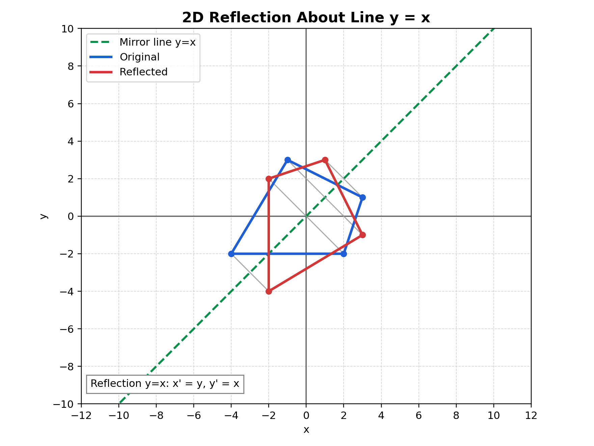

# 2D Reflection Note (Theory + Exact Matrix)

## Relevant Files
- Main demo: tutorials/lineDrawing/08_2d_reflection.py
- Java references: tutorials/2Dtrasformations/java_notes/reflection.java, tutorials/2Dtrasformations/java_notes/reflectionXY.java
- Composition demo: tutorials/lineDrawing/10_composing_transformations_.py

## Theoretical Base
Reflection is an isometry: it preserves distances but reverses orientation.

If a line L is the mirror axis, reflected points keep equal perpendicular distance to L on opposite sides.

## Exact Matrix Forms (Homogeneous 3x3)

### Reflection about X-axis
- Equation: x' = x, y' = -y

```text
| 1   0   0 |
| 0  -1   0 |
| 0   0   1 |
```

### Reflection about Y-axis
- Equation: x' = -x, y' = y

```text
| -1  0   0 |
|  0  1   0 |
|  0  0   1 |
```

### Reflection about Origin
- Equation: x' = -x, y' = -y

```text
| -1  0   0 |
|  0 -1   0 |
|  0  0   1 |
```

### Reflection about line y = x
- Equation: x' = y, y' = x

```text
| 0  1  0 |
| 1  0  0 |
| 0  0  1 |
```

### Reflection about line y = -x
- Equation: x' = -y, y' = -x

```text
|  0 -1  0 |
| -1  0  0 |
|  0  0  1 |
```

## Non-Origin Reflection Rule
For reflection about a line that does not pass through origin, shift first:

```text
M_non_origin = T(px, py) * M_reflect_origin_line * T(-px, -py)
```

This is the same principle used in composing transformations.

## Worked Example
Reflect P = (6, -2) about line y = x:

- x' = y = -2
- y' = x = 6

Result: P' = (-2, 6)

## Cartesian Plane Graph


Figure description: dashed green line is y=x mirror axis, blue is original, and red is reflected geometry.

## How to Verify in Code
In tutorials/lineDrawing/08_2d_reflection.py:
- Switch modes 1..5 and inspect matrix HUD.
- For same mode, applying reflection twice should return original points.
- Distances to mirror line remain equal before and after reflection.

## Common Mistakes
- Confusing y = x with y = -x matrix.
- Treating origin reflection as only one-axis reflection.
- Forgetting orientation flips under reflection.

## Quick Practice
1. Reflect a point twice about Y-axis and verify identity.
2. Compare reflection about origin with rotation by 180 degrees.
3. Explain why reflection keeps edge lengths unchanged.
