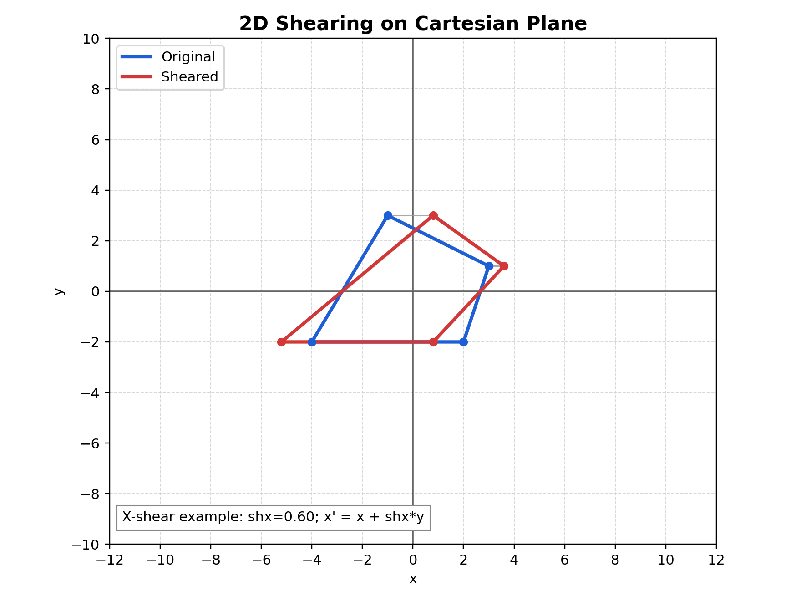

# 2D Shearing Note (Theory + Exact Matrix)

## Relevant Files
- Main demo: tutorials/lineDrawing/09_2d_shearing.py
- Java references: tutorials/2Dtrasformations/java_notes/shearing.java, tutorials/2Dtrasformations/java_notes/shearingY.java
- Composition demo: tutorials/lineDrawing/10_composing_transformations_.py

## Theoretical Base
Shear shifts one coordinate by an amount proportional to the other coordinate.

Unlike rotation/reflection, shear is not distance-preserving and usually changes angles.

## Exact Matrix Forms

### X-shear
- Equation: x' = x + shx*y, y' = y

```text
| 1  shx  0 |
| 0   1   0 |
| 0   0   1 |
```

### Y-shear
- Equation: x' = x, y' = y + shy*x

```text
| 1    0   0 |
| shy  1   0 |
| 0    0   1 |
```

### Combined shear (both X and Y simultaneously)

```text
| 1   shx  0 |
| shy  1   0 |
| 0    0   1 |
```

This gives:
- x' = x + shx*y
- y' = shy*x + y

## Non-Origin Shear Rule
For shearing around a pivot p = (px, py):

```text
H_p = T(px, py) * H * T(-px, -py)
```

This is required in composed transformations if operations should behave around a local center.

## Parameter Meaning
- shx: x shear factor
- shy: y shear factor

Interpretation:
- Positive and negative values tilt in opposite directions.
- Larger absolute value gives stronger slant.

## Worked Example
Apply X-shear with shx = 0.5 to P = (8, 6):

- x' = 8 + 0.5*6 = 11
- y' = 6

Result: P' = (11, 6)

Apply Y-shear with shy = -0.25 to same point:

- x' = 8
- y' = 6 + (-0.25)*8 = 4

Result: P' = (8, 4)

## Cartesian Plane Graph


Figure description: example shown for X-shear where y stays unchanged while x shifts proportionally to y.

## How to Verify in Code
In tutorials/lineDrawing/09_2d_shearing.py:
- Set factor to 0 and confirm identity transform.
- In X-shear mode only x changes with y dependence.
- In Y-shear mode only y changes with x dependence.

## Common Mistakes
- Confusing shear with rotation.
- Using wrong formula for selected mode.
- Forgetting that shearing changes angles and usually area.

## Quick Practice
1. Compare sh = 0.5 and sh = -0.5 in both modes.
2. Predict one vertex movement before checking on GUI.
3. Use both shx and shy in the composition GUI and inspect matrix effects.
