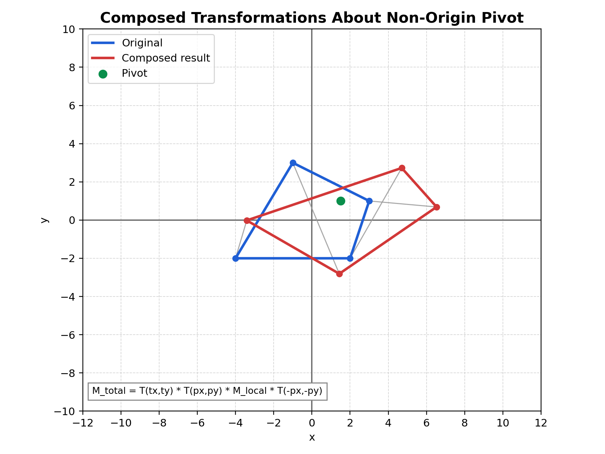

# Composing Transformations in 2D (Detailed Note)

## Relevant Files
- Composition GUI: tutorials/lineDrawing/10_composing_transformations_.py
- Translation GUI: tutorials/lineDrawing/05_2d_translation.py
- Scaling GUI: tutorials/lineDrawing/06_2d_scaling.py
- Rotation GUI: tutorials/lineDrawing/07_2d_rotation.py
- Reflection GUI: tutorials/lineDrawing/08_2d_reflection.py
- Shearing GUI: tutorials/lineDrawing/09_2d_shearing.py

## Why Composition Matters
In real graphics tasks, we rarely apply only one transform.
We usually need chains like:
- reflect, then scale
- shear, then rotate
- transform around an arbitrary pivot (not origin)
- then place object in world space

Matrix composition lets us do this as one matrix multiply per point:

P' = M_total * P

## Core Non-Origin Rule
For any local transform M_local around pivot p = (px, py):

M_around_pivot = T(px, py) * M_local * T(-px, -py)

This is the exact "move to origin -> transform -> move back" rule.

If we also want final world translation (tx, ty):

M_total = T(tx, ty) * T(px, py) * M_local * T(-px, -py)

## Exact Building Matrices

### Translation
T(tx, ty)

| 1  0  tx |
| 0  1  ty |
| 0  0   1 |

### Scaling
S(sx, sy)

| sx  0   0 |
| 0   sy  0 |
| 0   0   1 |

### Rotation
R(theta)

| cos(theta)  -sin(theta)  0 |
| sin(theta)   cos(theta)  0 |
|    0             0       1 |

### Shear (combined)
H(shx, shy)

| 1   shx  0 |
| shy  1   0 |
| 0    0   1 |

### Reflection examples
Ref_x:
| 1  0   0 |
| 0 -1   0 |
| 0  0   1 |

Ref_y:
| -1 0   0 |
|  0 1   0 |
|  0 0   1 |

Ref_origin:
| -1  0  0 |
|  0 -1  0 |
|  0  0  1 |

Ref_y_eq_x:
| 0 1 0 |
| 1 0 0 |
| 0 0 1 |

Ref_y_eq_neg_x:
|  0 -1 0 |
| -1  0 0 |
|  0  0 1 |

## Order of Multiplication (Critical)
Matrix multiplication is not commutative:

A * B != B * A

So order changes output.

In 10_composing_transformations_.py, local order is:
- Ref -> Scale -> Shear -> Rotate

With column vectors, this is implemented as:

M_local = R * H * S * Ref

Then wrapped around pivot and world translation:

M_total = T(tx, ty) * T(px, py) * M_local * T(-px, -py)

## Worked Numeric Example
Let:
- P = (4, 1)
- pivot p = (2, 2)
- theta = 90 deg
- sx = 1, sy = 1
- shx = 0, shy = 0
- reflection = none
- tx = 3, ty = -1

Because scale/shear/reflection are identity here, local matrix is only rotation.

Step 1: move to origin relative to pivot
- P_local = (4-2, 1-2) = (2, -1)

Step 2: rotate 90 deg around origin
- (x, y) -> (-y, x)
- P_rot = (1, 2)

Step 3: move back from pivot
- P_back = (1+2, 2+2) = (3, 4)

Step 4: world translation
- P' = (3+3, 4-1) = (6, 3)

Final result: (6, 3)

## Cartesian Plane Graph

Figure description: composed output around non-origin pivot using local transform chain and final world translation.

## Practical Interpretation
- T(-pivot): build local object space around pivot.
- M_local: shape-changing operations in local space.
- T(+pivot): return to world-relative position.
- T(tx, ty): place final transformed object.

## Common Mistakes
- Applying transforms in intended verbal order but wrong matrix order.
- Forgetting to convert to pivot-local coordinates.
- Mixing row-vector and column-vector conventions.
- Using degrees in trig functions without radians conversion.

## Validation Checklist
1. Set all transforms identity and verify M_total is identity.
2. Change only tx, ty and verify pure translation.
3. Change only angle and verify pivot stays fixed.
4. Turn on reflection and verify mirror behavior before other effects.
5. Set shx/shy and verify slant appears as expected.

## Suggested Exercises
1. Swap local order to S * R and compare with R * S.
2. Add a UI key to toggle order and observe geometric differences.
3. Reproduce one transformed vertex by manual calculation and compare with HUD.
